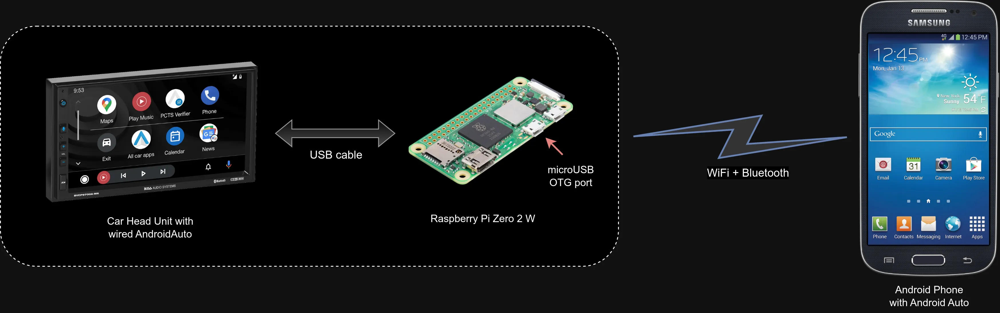
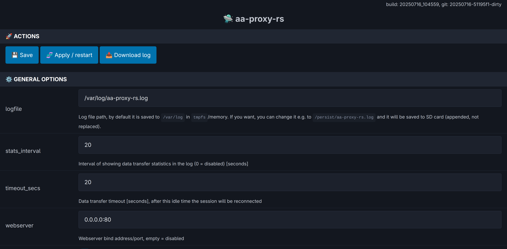
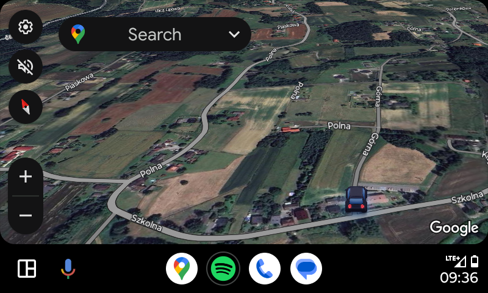
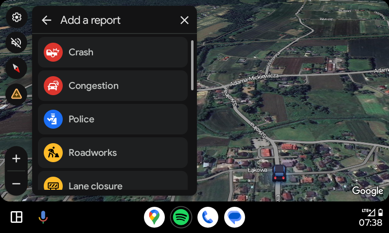

# 🛸 aa-proxy-rs

[](https://discord.gg/c7JKdwHyZu)

## About
This project is a DIY proxy tool that bridges a wireless Android phone with a USB-connected car head unit to enable the use of Android Auto.
Originally derived from the [WirelessAndroidAutoDongle](https://github.com/nisargjhaveri/WirelessAndroidAutoDongle) project (specifically as
a replacement for its `aawgd` component), it has since evolved into an independent and self-contained solution with its own development direction.

As with the original project, our primary focus is on supporting the Raspberry Pi. However, other boards are also currently in development,
including [AAWireless TWO](https://www.aawireless.io/en/products/aawireless-two) (thanks to collaboration with its creators)
and the [Radxa Zero 3W](https://radxa.com/products/zeros/zero3w/).


*Sample Connection Diagram – Raspberry Pi Zero 2 W*

## Features
- **Reliable and safe** – written in [Rust](https://www.rust-lang.org/), minimizing memory-related bugs and crashes
- **High performance** – uses modern [io_uring](https://kernel.dk/io_uring.pdf) kernel API for efficient I/O handling
- **Automatic reconnection** – attempts to recover Android Auto connection in all failure scenarios
- **Transfer monitoring** – displays bandwidth usage and real-time transfer statistics
- **[Embedded web interface](#embedded-web-interface)** – lightweight UI for status and control
- **Stall detection** – detects and handles stalled data transfers
- **[MITM (Man-in-the-Middle) mode](#mitm-mode)** – supports advanced tweaks and modifications:
  - DPI change
  - Remove tap restriction
  - Disable media sink
  - Disable TTS sink
  - Video in motion
  - Enable developer mode
- **[Google Maps EV Routing](#google-maps-ev-routing)** – allows EV-specific navigation features
- **Wired USB phone mode** – works without the Bluetooth handshake or Wi-Fi pairing
- **Support for Google’s Desktop Head Unit (DHU)** – ideal for debugging and development

## Current project status
After extensive stress testing and continuous development, the project has reached a level of stability that meets its original goals.
I now use it almost daily in my own car and continue to fix any issues that come up to ensure a smooth and reliable experience.<br>
There's also a great and supportive community on Discord built around this project. If you'd like to join, ask questions, or get help,
feel free to connect with us on the [aa-proxy Discord](https://discord.gg/c7JKdwHyZu) server.

## Supported Hardware
This project is currently tested and built for the following Raspberry Pi boards that support USB OTG:
- Raspberry Pi Zero W
- Raspberry Pi Zero 2 W
- Raspberry Pi 3 A+
- Raspberry Pi 4

> [!NOTE]
> **Raspberry Pi 3 B+ is _not_ supported** due to the lack of USB OTG support.

> [!WARNING]
> - **2.4GHz Wi-Fi is being deprecated by Google** and is no longer a reliable long-term solution.  
>   Newer head units with higher resolutions (e.g. Full HD displays in some Kia/Hyundai models) require **5GHz Wi-Fi**
>   to function **with full resolution support**.  
>   Only boards with 5GHz-capable Wi-Fi chips will be able to utilize the full display resolution.  
>   Simply changing the DPI will not solve this limitation.
>
> - Additionally, **2.4GHz Wi-Fi can interfere with Bluetooth**, since both operate on the same frequency band.  
>   This can occasionally cause connection issues — especially during the initial pairing phase when both Wi-Fi and Bluetooth are active.
>   The problem is particularly noticeable on devices like the **Raspberry Pi Zero 2 W**.

Work is currently in progress to support additional hardware platforms, including:
- **AAWireless TWO** – thanks to collaboration with its creators
- **Radxa Zero 3W**

In theory, support can be extended to other hardware platforms in the future, as long as the following basic requirements are met:
- USB OTG or USB Gadget mode support
- Wi-Fi and Bluetooth (either built-in or via external adapters)

The latest stable SD card images are available on the [Releases page](https://github.com/manio/aa-proxy-rs/releases).

## First-time Connection
1. Connect your phone to the car head unit using a USB cable and verify that Android Auto starts successfully. Then disconnect the phone.
2. Connect the board to the car using a data-capable USB cable and ensure you use the USB OTG-enabled port on the board:
   - **Raspberry Pi Zero W** and **Raspberry Pi Zero 2 W**: Use the second micro-USB port labeled "USB" (not the one labeled "PWR").
   - **Raspberry Pi 3 A+**: Use the only USB-A port with a USB-A to USB-A cable.
   - **Raspberry Pi 4**: Use the USB-C port normally used to power the board.
3. Open Bluetooth settings on your phone and pair with the new device named `aa-proxy-*`.
4. After pairing, your phone should automatically connect via Wi-Fi, and the dongle will connect to the head unit via USB, starting Android Auto on the car screen.

From the next time onward, the system should automatically connect to your phone and start Android Auto without additional steps.

> [!WARNING]
> For convenience during the initial setup, SSH access is enabled by default and the device uses a predefined Wi-Fi password.
> **It is strongly recommended to change these defaults and/or disable SSH access for security reasons.**

> [!NOTE]
> 📶 **Default Wi-Fi credentials:**  
> SSID: `aa-proxy`  
> WPA password: `aa-proxy`  
>
> 🔐 **Default SSH credentials:**  
> User: `root`  
> Password: `password`  
>
> See below for instructions on how to connect to the device's Wi-Fi network.

## Embedded Web Interface
When you connect to the device's WiFi network, you can access the web interface, which is available by default at: [http://10.0.0.1](http://10.0.0.1).

> [!WARNING]
> If you want to connect to the device (e.g. via the web interface or SSH) **while Android Auto is running**, it won't be accessible from your phone. In that case, you have two options:
> - Use a different device, such as a laptop or another phone, to connect to the device’s Wi-Fi network.
> - Or stop Android Auto temporarily, for example by:
>   - Enabling airplane mode, then enabling Wi-Fi only and connecting manually, **or**
>   - Disabling both Wi-Fi and Bluetooth, waiting a moment, then re-enabling Wi-Fi and connecting manually.
>
> If you're still having trouble connecting, try disabling MAC address randomization.
> [This guide](https://help.kings.edu/hc/en-us/articles/4406119218455-How-to-Disable-Randomized-MAC-Addresses-on-Android) provides clear instructions on how to do it on Android.

Using the web interface, you can configure all settings that are also available in `/etc/aa-proxy-rs/config.toml`:



You can also download logs with a single click.

## MITM mode
Man-in-the-middle mode support has been added recently. This is the mode which allows to change the data passed between the HU and the phone.
Separate encrypted connections are made to each device to be able to see or modify the data passed between HU and MD.<br>
This is opening new possibilities like, e.g., forcing HU to specific DPI, adding EV capabilities to HU/cars which doesn't support this Google Maps feature.<br>
All the above is not currently supported but should be possible and easier with this mode now implemented.<br>
To have this mode working you need enable `mitm` option in configuration and provide certificate and private key for communication for both ends/devices.
Default directory where the keys are search for is: `/etc/aa-proxy-rs/`, and the following file set needs to be there:<br>
- hu_key.pem
- hu_cert.pem
- md_key.pem
- md_cert.pem
- galroot_cert.pem

I will not add these files into this repository to avoid potential problems. You can find it in other places, or even other git repos, like:<br>
- https://github.com/tomasz-grobelny/AACS/tree/master/AAServer/ssl
- https://github.com/tomasz-grobelny/AACS/tree/master/AAClient/ssl
- https://github.com/lucalewin/vehiculum/tree/main/src/server/cert
- https://github.com/lucalewin/vehiculum/tree/main/src/client/cert
- https://github.com/borconi/headunit/blob/master/jni/hu_ssl.h#L29

Special thanks to [@gamelaster](https://github.com/gamelaster/) for the help, support and his [OpenGAL Proxy](https://github.com/gamelaster/opengal_proxy) project.

### DPI settings
Thanks to above MITM mode a DPI setting of the car HU can be forced/replaced. This way we can change the hardcoded value to our own. This is allowing to view more data (at cost of readability/font size).<br>
Example with Google Maps, where a `Report` button is available after changing this value:

|160 DPI (default)|130 DPI|
|---|---|
||

## Google Maps EV routing
Google introduced EV routing features at [CES24](https://blog.google/products/android/android-auto-new-features-ces24/).
The first cars to support this via Android Auto are the Ford Mustang Mach-E and F-150 Lightning.

This clip shows how it works in the car:<br>
[](https://www.youtube.com/embed/M1qf9Psu6g8)

The idea of using this feature with other cars started here: https://github.com/manio/aa-proxy-rs/issues/19 in February 2025.
After a long journey searching for someone with the knowledge and hardware that could help us obtain the logs, we finally, at the end of June 2025,
thanks to [@SquidBytes](https://github.com/SquidBytes), got the sample data to analyze.

Thanks to many hours of work by [@Deadknight](https://github.com/Deadknight) and [@gamelaster](https://github.com/gamelaster), we were finally
able to make some use of that data.
Unfortunately, the work is still in progress, but I am currently at a stage where, by customizing some parameters, I can provide real-time battery
level data to `aa-proxy-rs`, and overall it makes correct estimates for my car.

`aa-proxy-rs` has an embedded REST server for obtaining battery data from any source (I am using a slightly modified version of the
[canze-rs](https://github.com/manio/canze-rs) app for this purpose).
It reads the data on the same Raspberry Pi (connecting wirelessly to the Bluetooth OBD dongle).

`aa-proxy-rs` can be configured to execute a specific data collection script when Android Auto starts and needs the battery level data, and also when it stops.
The script can be configured in `config.toml` and is executed with the arguments `start` and `stop` accordingly.

Thanks to the power of open source, even older EVs can now enjoy modern features and a much better navigation experience!

## Troubleshooting
Sometimes deleting the system Bluetooth cache at /var/lib/bluetooth and restarting bluetoothd fixes persistent issues with device connectivity.
Consider also using "Forget" of bluetooth device in the Android phone.

By default, the application logs to the file:
`/var/log/aa-proxy-rs.log`

This log can be useful for troubleshooting and diagnosing issues.

You can easily download the log file via the [embedded web interface](#embedded-web-interface).

## History and Motivation
There are many commercial solutions available for wireless Android Auto, such as AAWireless or Motorola MA1. I even bought a
clone from AliExpress — but unfortunately, it didn’t work in my car (I ended up giving it to a friend who had a compatible vehicle).

Thanks to [Nicnl](https://www.reddit.com/user/Nicnl/) on Reddit, who commented under [this post](https://www.reddit.com/r/RenaultZoe/comments/1c5eg2g/working_wireless_aa_for_rlink1_based_zoe/),
I discovered a great open-source project based on Raspberry Pi hardware:
[**WirelessAndroidAutoDongle**](https://github.com/nisargjhaveri/WirelessAndroidAutoDongle) by [Nisarg Jhaveri](https://github.com/nisargjhaveri).

The author did some excellent research and created a working DIY solution — and most importantly, he shared it openly with the community.
That’s something I truly admire and appreciate!

Because the project is open source, I was even able to run additional LoRa hardware on the same Raspberry Pi for a completely different purpose.

The original project uses a daemon called `aawgd`, which handles proxying data between the phone and the USB-connected head unit.
Unfortunately (or fortunately!), the original implementation wasn’t always reliable in my case — I experienced crashes, failed reconnections,
and the need to restart the service manually.

After submitting [this pull request](https://github.com/nisargjhaveri/WirelessAndroidAutoDongle/pull/196), I decided to create a Rust-based
alternative to `aawgd`. That’s how this project started — by reimplementing the C++ code into a new, standalone application written in Rust.

## Coding
From the beginning, I aimed to simplify parts of the original code wherever possible.
This project also became a great opportunity (and a lot of fun!) to dive deeper into how the system was designed and how everything works under the hood.

One of the biggest challenges I faced was implementing reliable bidirectional I/O forwarding.
Since the entire application is asynchronous and uses [Tokio](https://tokio.rs/), my first instinct was to use [`copy_bidirectional`](https://docs.rs/tokio/latest/tokio/io/fn.copy_bidirectional.html).
However, this approach didn’t work as expected — likely due to how the USB socket for the `usb-gadget` kernel module interacts with polling/epoll mechanisms.

I also experimented with running separate read/write operations inside Tokio tasks, but ultimately found a better solution:
using the modern [io_uring](https://kernel.dk/io_uring.pdf) interface via the [`tokio_uring`](https://github.com/tokio-rs/tokio-uring) library.

This approach turned out to be both highly efficient and completely stable — solving the problem in a clean and performant way.

## Limitations
- The project depends on the kernel-level [io_uring](https://kernel.dk/io_uring.pdf) API for its core data transfer functionality.
  As a result, **Linux kernel version 5.10 or newer is required**.

- Please note: I work on this project in my free time as a hobby.
  While I do my best to respond and fix issues, I can't always guarantee quick replies or provide ETAs for requested features.

## How it works (technical)
The connection process is quite complex and involves several carefully timed steps to establish a stable link between the phone and the car head unit. Below is an overview of what the app does from start to finish:

- **USB:** Disable all existing USB gadgets.
- **USB:** Register for uevents to monitor USB state changes.
- Start a local TCP server.
- **Bluetooth:** Power up the Bluetooth adapter and make it discoverable and pairable.
- **Bluetooth:** Register two profiles:
  - One for Android Auto,
  - One for a fake headset (to trick the phone into recognizing a wireless Android Auto head unit).
- When a phone connects to the Android Auto profile, the app sends two frames with specific Google protocol data:
  - `WifiStartRequest`: includes the IP address and port of the TCP server the phone should connect to.
  - `WifiInfoResponse`: contains the Access Point information for the Wi-Fi connection.
- After receiving a successful response, the tool disables Bluetooth.
- The phone connects to the car’s Bluetooth (e.g., for phone calls).
- Simultaneously, the phone connects via Wi-Fi to our TCP server on the specified port.
- **USB:** Switch USB gadgets to “default” followed by “accessory” mode to enable proper USB data transmission to the car head unit (fooling the car into thinking the phone is connected via USB).
- **Final stage:** Bidirectional forwarding of data between the TCP client (phone) and USB port (car).

The USB side is the active initiator of data transmission, starting with sending a 10-byte first frame. Because of this, timing is critical:
- If the USB dongle connection starts too early (before the phone is connected), the transmission begins but the TCP socket isn’t ready yet.
- Conversely, if the phone starts too early and the USB connection is not ready, data cannot be sent to the phone, causing Android Auto to close or timeout the connection.

Proper synchronization between these steps ensures a stable and reliable connection.

## Demo
[](https://asciinema.org/a/686949)

## Manual configuration
Default startup config file is `/etc/aa-proxy-rs/config.toml`.

Configuration options are documented in comments, but these needs some more attention:<br>
- `legacy`<br>
Original `aawgd` is using two USB gadgets: **default** and **accessory**. When connecting to car headunit, it switches first to **default** then to **accessory**.
During my development I found out that my car headunit doesn't need this switching. It is working fine connecting directly to **accessory** gadget.
Moreover with this approach it is much faster and doesn't need to wait for USB events in dedicated _UEvent_ thread. As the result I decided to leave the old (legacy)
code under this switch for compatibility with some headunits.<br>
In short: if you have problems with USB connection try to enable the legacy mode.

- `connect`<br>
By default without this option the aa-proxy-rs is starting but it is only visible as a bluetooth dongle, to which you have to connect manually from your phone to
initiate AndroidAuto connection. If I am correct this was called `dongle mode` in `aawgd`.<br>
If you provide `connect` option with default `00:00:00:00:00:00` wildcard address, then the daemon is trying to connect to known (paired?) bluetooth devices (phones) in a loop
(the **bluetoothd** have a cached list of recently connected devices in /var/lib/bluetooth).<br>
If you set this option to specific `MAC_ADDRESS` where MAC_ADDRESS is the MAC of your phone (bluetooth), then the aa-proxy-rs will try to connect only to this specified device
in a loop (ignoring all **bluetoothd** cached devices).

## Building

If you'd like to build the SD card images yourself, head over to our Buildroot repository:<br>
**https://github.com/aa-proxy/buildroot**

There you’ll find all the necessary tools and instructions to generate custom images tailored to your hardware or specific needs.

## Stand-alone Usage

While the aa-proxy-rs binary is typically used as part of the prebuilt system image, it can also be run manually:

```
Usage: aa-proxy-rs [OPTIONS]

Options:
  -c, --config <CONFIG>         Config file path [default: /etc/aa-proxy-rs/config.toml]
  -g, --generate-system-config  Generate system config and exit
  -h, --help                    Print help
  -V, --version                 Print version
```

> [!WARNING]
> Kernel Requirements for Stand-alone Usage
>
> If you plan to run **aa-proxy-rs** on your own system (outside of the provided system images), be aware that additional **custom kernel modules** are required for full functionality. These modules are not upstreamed and must be built separately.

You can find the necessary patches here:  
👉 **[https://github.com/aa-proxy/buildroot/tree/main/external/patches/linux](https://github.com/aa-proxy/buildroot/tree/main/external/patches/linux)**

Please keep this in mind when creating your own custom solution with `aa-proxy-rs`.

To achieve full functionality similar to the official Buildroot-based images, make sure the following kernel options are enabled as well:
- CONFIG_USB_CONFIGFS_UEVENT
- CONFIG_USB_CONFIGFS_F_ACC
- CONFIG_BT_RFCOMM
- CONFIG_BT_RFCOMM_TTY

## Similar/other open source AndroidAuto-related projects
- https://github.com/nisargjhaveri/WirelessAndroidAutoDongle
- https://github.com/nisargjhaveri/AAWirelessGateway
- https://github.com/openDsh/openauto
- https://github.com/qhuyduong/AAGateway
- https://github.com/Demon000/web-auto
- https://github.com/f1xpl/openauto
- https://github.com/gamelaster/opengal_proxy
- https://github.com/tomasz-grobelny/AACS
